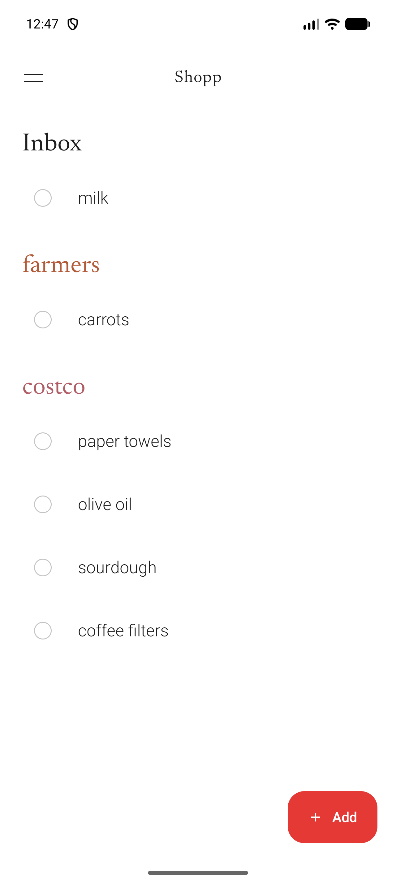
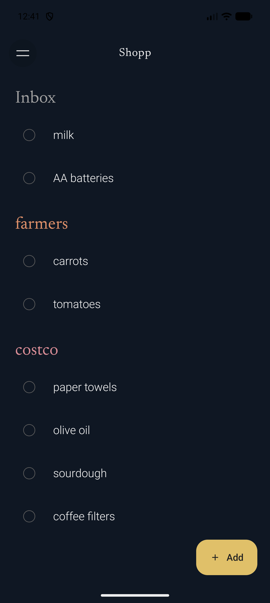
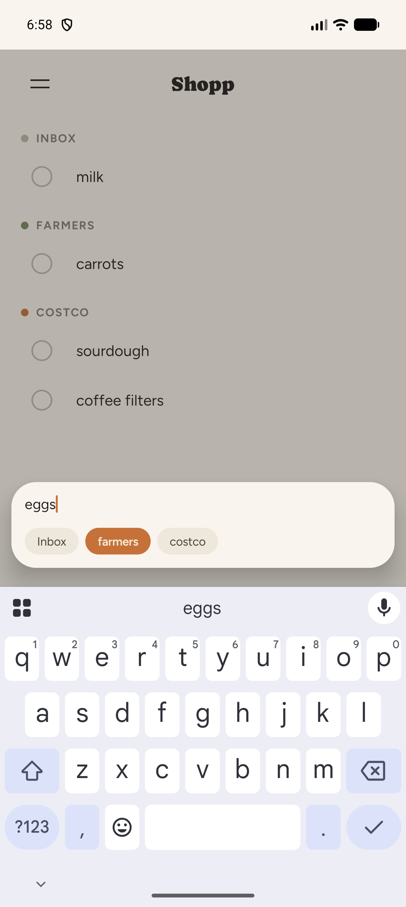
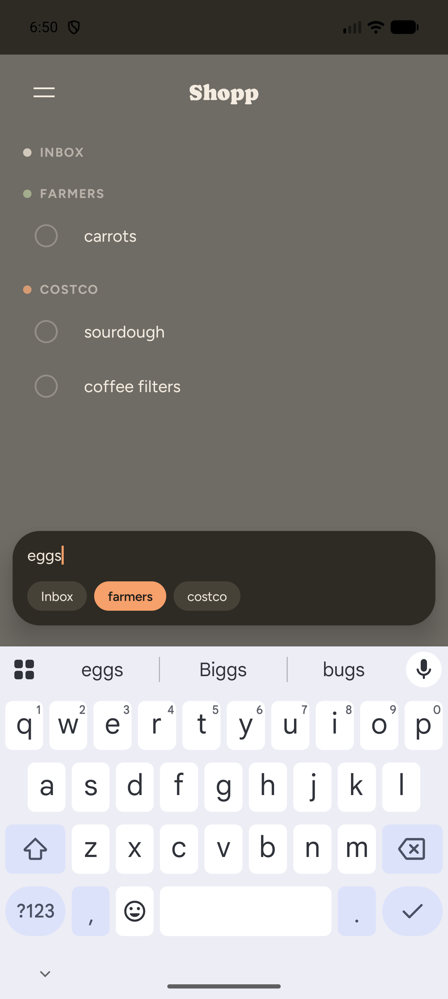
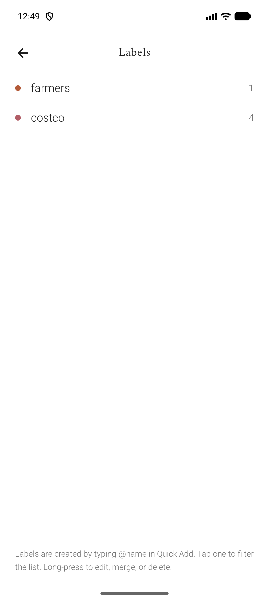
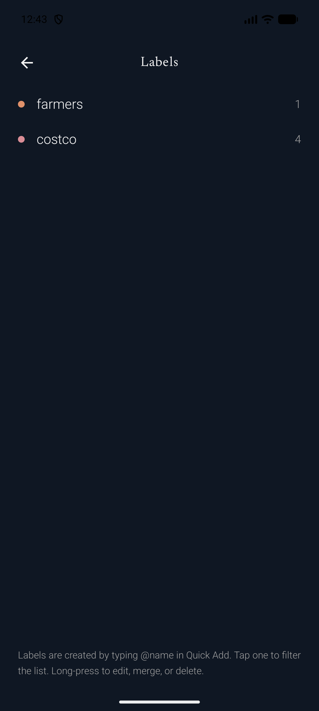
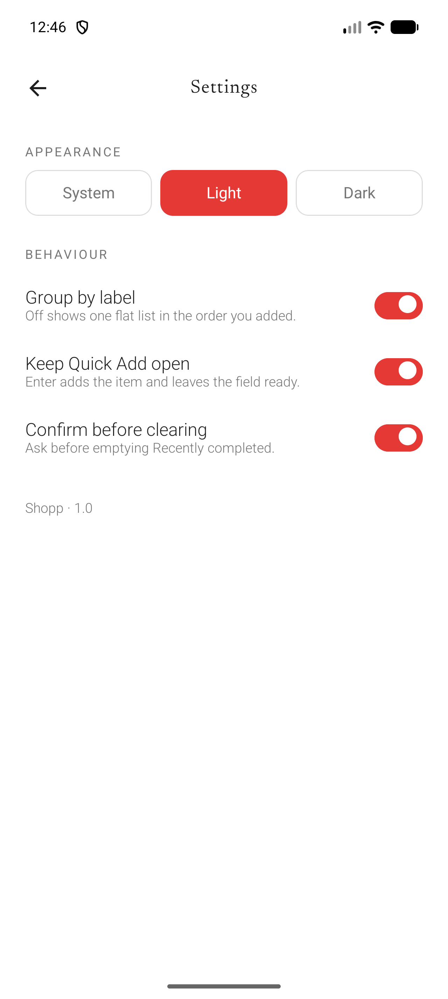
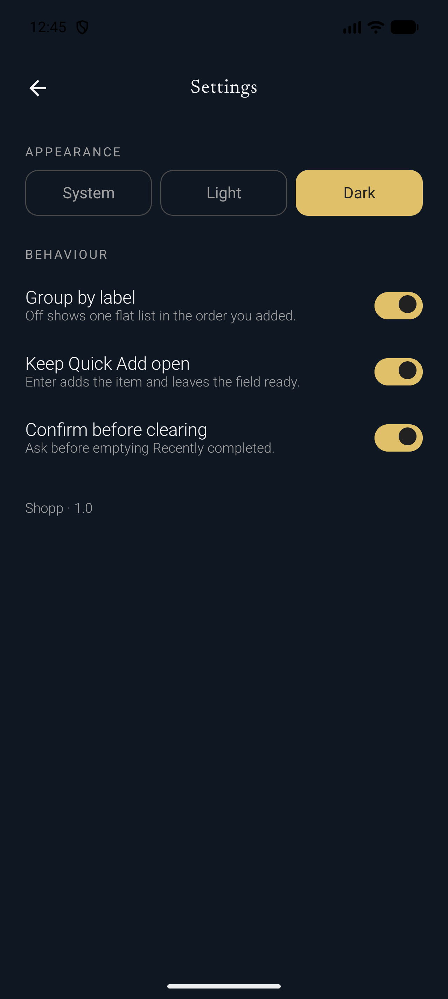

# Shopp

A fast, native Android shopping list app. Type an item, tag it with `@label` to route it into a section, tap to check it off, and add items from the lock screen through a Quick Settings tile without unlocking the phone.

Free and open source. **[Download the latest release](https://github.com/rrajath/shopp/releases/latest)** · [Full documentation](docs-site/) · Requires Android 8.0 (API 26) or newer.

## Screenshots

| | Light | Dark |
|---|---|---|
| **List** |  |  |
| **Quick Add** |  |  |
| **Labels** |  |  |
| **Settings** |  |  |

More screens (autocomplete, merging labels, Recently Completed, and the Quick Settings tile capture surface) are in [`screenshots/`](screenshots/) and in the [documentation site](docs-site/).

## Purpose

Shopp implements the product requirements in `internal-docs/shopping-list-prd.md` and the technical design in `internal-docs/shopping-list-tdd.md`, adapted to a pure native Android stack (see [Architecture](docs/ARCHITECTURE.md) for why). The visual design and screen scope follow the prototype at `internal-docs/design/Shopp Prototype.dc.html`, which takes precedence over the PRD where the two disagree.

## The problem it solves

Shopping lists fail at the moment they're needed most: standing in an aisle, or remembering something the second before you fall asleep. Shopp is built around that moment specifically:

- **Capture has to be instant.** A shared Quick Settings tile opens a translucent capture surface over whatever's on screen — including the lock screen — writes directly to the same on-device database the main app reads, and gets out of the way.
- **Organizing can't cost extra taps.** Typing `@label` inline while capturing an item files it into a section immediately; there's no separate "assign a category" step.
- **Undo has to be trustworthy.** Checking an item off is instant and real (not optimistic-then-maybe-fails), but a 4-second undo window means a mis-tap never costs you the item.

## Features

- **Quick Add** — a compact floating capture overlay (anchored above the keyboard, not a full-width bottom sheet) with autofocus, multi-line paste support, inline `@label` tagging with autocomplete, a sticky label chip that persists across consecutive adds, and title suggestions drawn from your Recently Completed history for items you buy on a cycle.
- **Quick Settings tile** — add items without unlocking the phone or opening the app; the tile launches a translucent activity over the lock screen that shares the exact same capture component and database as the in-app flow.
- **Sectioned list** — items group by label (Inbox always shown first), with sticky section headers while scrolling; grouping can be turned off in Settings for one flat list.
- **Tap-to-complete with undo** — completing an item is a real, immediate write; a toast with a 4-second undo window follows, and a new completion during that window commits the previous one and starts a fresh timer.
- **Inline edit** — tap an item's title to edit it in place, with the text caret placed at the exact point you tapped.
- **URL linkification** — a URL typed into a title becomes a tappable link without entering edit mode.
- **Recently Completed** — a reverse-chronological log of completed items, grouped by day, with tap-to-re-add and a Clear action (optionally confirmed).
- **Labels management** — rename, recolor (pick from a 15-color palette, or let it auto-allocate), merge, or delete labels via a long-press sheet; deleting a label moves its items to Inbox rather than deleting them, merging reassigns items then removes the source label, both atomically.
- **Settings** — System/Light/Dark appearance, and three behavior toggles (group by label, keep Quick Add open after submit, confirm before clearing Recently Completed).

## Setup

**Requirements**

- Android Studio with an Android SDK including platform 36 and build-tools for it
- JDK 21
- An emulator or device running Android 8.0 (API 26) or newer

**Build and run**

```sh
./gradlew :app:assembleDebug
./gradlew :app:installDebug
```

Or open the project in Android Studio and run the `app` configuration.

The debug build installs as a separate app ("Shopp Debug", package `com.rrajath.shopp.debug`) alongside a release build (`com.rrajath.shopp`), so both can be on the same device at once.

**Run tests**

```sh
./gradlew :app:testDebugUnitTest
```

**Release builds**

Release builds are signed with a local keystore that is never committed to git. To build `assembleRelease` on a new machine:

1. Generate a keystore (skip if you already have one):
   ```sh
   keytool -genkeypair -v -keystore app/keystore/shopp-release.jks -alias shopp -keyalg RSA -keysize 2048 -validity 10000
   ```
2. Copy `keystore.properties.example` to `keystore.properties` at the project root and fill in the values (`storeFile` is relative to the project root, e.g. `app/keystore/shopp-release.jks`).
3. Build: `./gradlew :app:assembleRelease`

Both `keystore.properties` and `app/keystore/` are gitignored. If `keystore.properties` is missing, `assembleRelease` still builds but produces an unsigned APK.

The release build type has R8 minification and resource shrinking enabled (`isMinifyEnabled`/`isShrinkResources`), which cuts the APK from ~12 MB down to ~1.6 MB. The debug build type stays unminified for fast iteration and readable stack traces.

**Cutting a release**

Releases are manual, not triggered by every push to `main`. `.github/workflows/release.yml` builds a signed release APK and publishes a GitHub Release when you either:

- run it by hand from the Actions tab (or `gh workflow run release.yml`), or
- push a git tag matching `v*` (e.g. `git tag v0.2 && git push origin v0.2`)

`versionName` is hand-controlled: bump `VERSION_NAME` in `gradle.properties` before cutting a release. `versionCode` is computed automatically by the workflow as `(existing GitHub release count) + 1` and passed to Gradle via `-PVERSION_CODE`, so it always increments by one and never needs manual bookkeeping. Local builds default `versionCode` to `1` since the exact value doesn't matter outside of a release.

The release tag is either the git tag you pushed, or (if triggered manually) `v<VERSION_NAME>-<computed versionCode>`.

The workflow needs four repository secrets under Settings > Secrets and variables > Actions:

| Secret | Value |
| --- | --- |
| `RELEASE_KEYSTORE_BASE64` | `base64 -i app/keystore/shopp-release.jks` output |
| `RELEASE_KEYSTORE_PASSWORD` | `storePassword` from `keystore.properties` |
| `RELEASE_KEY_PASSWORD` | `keyPassword` from `keystore.properties` |
| `RELEASE_KEY_ALIAS` | `keyAlias` from `keystore.properties` |

**Try the Quick Settings tile**

Pull down the notification shade twice to reach Quick Settings, tap the pencil/edit icon, and drag the "Add to Shopp" tile into your active tiles. Long-pressing (or tapping, depending on Android version) it opens the capture sheet without unlocking the phone.

## Architecture

Shopp is a single Kotlin + Jetpack Compose Gradle module (`:app`) — no multiplatform tooling, no backend, no network calls. Everything lives in one on-device Room (SQLite) database:

- **UI**: Jetpack Compose screens (`ui/screens/`) driven by `ShoppViewModel`, with manual dependency injection (`AppContainer`, built once in `ShoppApplication`) instead of Hilt/Dagger.
- **Domain/use cases**: pure Kotlin (`domain/`, `usecases/`) — the `@label` capture parser, UUIDv7 generation, label color allocation, and one class per mutation (capture, complete, undo, merge, delete, etc.), each wrapped in a single Room transaction.
- **Data**: Room entities and DAOs (`data/db/`, `data/repository/`) implementing the schema from the technical design doc — UUID primary keys, `updated_at` on every row, and soft deletes (tombstones) everywhere, so the app is sync-ready even though v1 has no accounts or sync.
- **Capture surface**: the Android Quick Settings tile (`capture/QuickAddTileService.kt`, `CaptureActivity.kt`) opens the *exact same* Quick Add UI and controller as the in-app FAB, sharing the same `AppContainer` and database connection — not a separate, simplified implementation that could drift out of sync.

The product requirements and technical design docs (`internal-docs/`) originally specified a cross-platform React Native + iOS + web build with native "capture kernels." The shipped app is pure native Android instead, which removes that plan's biggest engineering risk (keeping a capture parser in sync across three languages) by construction — see [docs/ARCHITECTURE.md](docs/ARCHITECTURE.md) for the full package breakdown and the reasoning behind every deviation from those documents, and [docs/DESIGN_SYSTEM.md](docs/DESIGN_SYSTEM.md) for the color/type/spacing tokens and component inventory.

## Status

All 11 implementation milestones are complete — see `PROGRESS.md` (gitignored, local-only) for the detailed build log, bugs found and fixed along the way, and testing notes.
